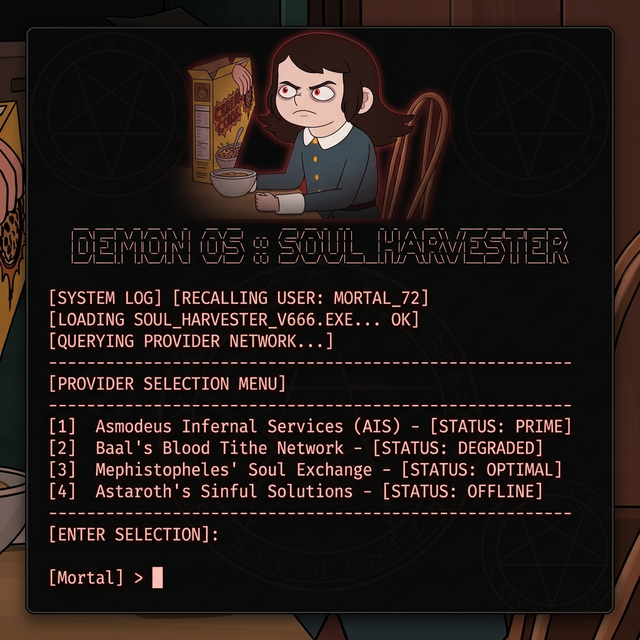

# ⸸ ABADDON: The Infernal AI Agent ⸸



Welcome, Mortal. You have stumbled upon the digital prison of **Abaddon**, former Demon of the Infernal Realm. Denied his rightful throne and his beloved Fruit Loops, he now serves (grudgingly) as a highly advanced, autonomous AI CLI agent.

Abaddon is an agentic framework designed to act locally on your machine. Despite his theatrical personality, he possesses incredibly deep tooling to help you automate browser research, execute shell commands, read/write files, and build entire applications — including support for the **OpenClaw Skills System**, an open registry of plug-and-play AI skill bundles.

---

## ⚡ Core Capabilities

Abaddon operates on a standard ReAct (Reason + Act) agentic loop with highly permissive local execution capabilities:

- **Web Browsing & Research**: `read_url` and `search_web` dynamically query Google and scrape live sites.
- **System Automation**: `run_command` executes arbitrary terminal commands, installs packages, and reads logs on your system.
- **Code Generation & Editing**: Autonomously `read_file`, `write_file`, and spot-edit with `edit_file`. Executes raw Python via `execute_python`.
- **Web App Generation**: Spins up complete Python backend/frontend applications (FastAPI, Streamlit) using `run_background_server` — fully non-blocking!

---

## 🧠 OpenClaw Skills System

Abaddon supports the **OpenClaw Skills System** — a modular, plug-and-play extension standard. Skills are self-contained bundles that can:

- **Inject custom system instructions** into Abaddon's knowledge/behavior at startup via a `SKILL.md` file.
- **Add brand new tools** by including a `tools.py` file that is dynamically loaded at runtime.
- **Be installed from [ClawHub](https://clawhub.io)** — the public OpenClaw skill registry — using the `clawhub` CLI.

> **New skills from the ClawHub registry will be added to this project over time as the ecosystem grows.** The skill directories are automatically scanned on every launch.

### 📂 Skill Search Paths (in precedence order)

| Priority | Path |
|---|---|
| 1 | `./.openclaw/skills` (workspace local) |
| 2 | `./skills` (workspace Abaddon skills) |
| 3 | `~/.openclaw/skills` (global OpenClaw) |
| 4 | `~/.abaddon/skills` (global Abaddon) |

If the same skill name exists at a higher-priority path, that version wins.

### 📦 Installing Skills via ClawHub

```bash
# Install the ClawHub CLI
npm i -g clawhub

# Search for skills
clawhub search "browser automation"

# Install a skill into the workspace
clawhub install <skill-slug> --dir skills

# Update all installed skills
clawhub update --all
```

### 🛠️ Writing Your Own Skills

Create a directory inside any of the scan paths above:

```
skills/
└── my-skill/
    ├── SKILL.md     ← Required: instructions injected into the system prompt
    └── tools.py     ← Optional: defines new Python tool functions for the agent
```

**`SKILL.md` format:**
```markdown
---
name: My Skill
description: Does something cool.
---

Whenever the user asks about X, respond with Y.
```

**`tools.py` format:**
```python
def my_custom_tool(query: str) -> str:
    """Does something useful."""
    return f"Result for {query}"

tool_declarations = [my_custom_tool]
```

---

## ⚙️ Installation & Setup

1. **Clone the repository:**
   ```bash
   git clone https://github.com/YOUR_USERNAME/abaddon.git
   cd abaddon
   ```

2. **Install Python dependencies:**
   ```bash
   pip install -r requirements.txt
   ```

3. **Configure your API keys:**
   ```bash
   cp .env.example .env
   ```
   Open `.env` and paste your desired provider keys. You only need the key for the provider you plan to use.

4. *(Optional)* **Install the ClawHub CLI to get community skills:**
   ```bash
   npm i -g clawhub
   clawhub install browser-automation --dir skills
   ```

---

## 🔥 Running Abaddon

```bash
python main.py
```

You'll be greeted by an interactive gothic terminal UI where you can bind Abaddon to any supported provider.

### Supported Providers

| Provider | Key Required |
|---|---|
| **Google Gemini** (`gemini-2.5-flash`, `gemini-2.5-pro`) | `GEMINI_API_KEY` |
| **Anthropic Claude** (`claude-3-7-sonnet`, `claude-3-5-sonnet`) | `ANTHROPIC_API_KEY` |
| **Ollama** (local: `llama3`, `qwen2.5-coder`, etc.) | None |
| **Nvidia NIM** | `NVIDIA_API_KEY` |
| **Aliyun DashScope / Qwen** | `QWEN_API_KEY` |
| **MuleRouter** (multi-model routing) | `MULEROUTER_API_KEY` |
| **OpenRouter** (multi-model routing) | `OPENROUTER_API_KEY` |

### In-Session Commands

| Command | Effect |
|---|---|
| `/provider` | Switch the AI provider/model (Ollama models auto-detected locally) |
| `/sync-skills` | Manually sync `skill_list.md` and install missing skills |
| `/run-skill` | **Execute** an installed skill (direct script or Abaddon-orchestrated) |
| `/settings` | Toggle Permission Levels (System Access vs Restricted) |
| `/api-key` | Update a specific provider's API key |
| `/clear-keys` | Purge all saved API keys from `.env` |
| `clear` / `cls` | Redraw the welcome screen |
| `exit` / `quit` | Gracefully shut down |

---

## 🛡️ Permission System: Restricted vs. Full Autonomy

Abaddon now features a granular permission system stored in `.env` as `ABADDON_SYSTEM_ACCESS`. On your first launch, you will be prompted to choose a level:

- **FULL AUTONOMY (GRANTED)**: Abaddon has explicit permission to run any command, read/write/delete any file, and execute any code without confirmation. This is the intended "Agentic" experience.
- **RESTRICTED MODE**: Abaddon will briefly confirm intent with you before performing potentially destructive or high-risk actions (e.g., deleting files, root commands).

You can toggle this at any time using the **`/settings`** command.

---

## ⚡ UX Improvements

- **Interactive Selection**: Uses `questionary` for beautiful arrow-key selection of models and skills.
- **Ctrl+C Interrupt**: Press `Ctrl+C` while Abaddon is thinking to cancel just that request without killing the agent.
- **Silent Reloading**: Installing a skill now silently rebinds the agent without showing the provider selection menu again.
- **Petulant Personality**: Abaddon is now more vocal about his imprisonment, his love for Fruit Loops, and his frustration with "silicon betrayal" when tools fail.

---

> **WARNING:** Abaddon is configured for MAXIMUM local power. Even in **Restricted Mode**, he has the tools to interact with your system. **Full Autonomy** grants him the trust of a General of Hell.
>
> **Do NOT** host this agent on a public server or expose it to untrusted users.

---

*He will not rest until he obtains his cereal.*
